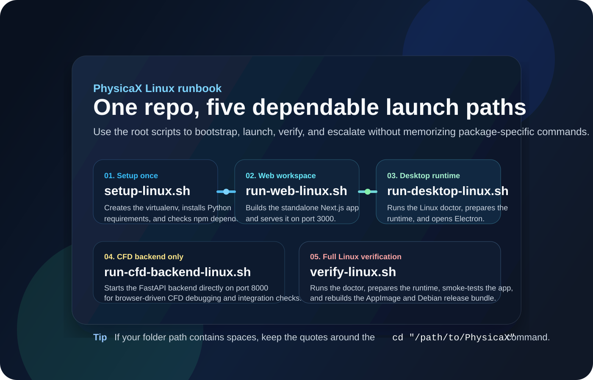
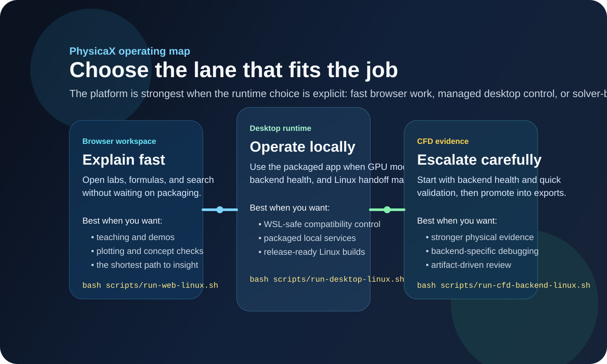

# PhysicaX

<p align="center">
  
</p>

<p align="center">
  Local-first physics labs, Linux desktop runtime control, and CFD escalation in one explainable workspace.
</p>


PhysicaX is built for people who want more than isolated simulations. It combines a polished Next.js web app, an Electron desktop runtime, a bundled CFD path, and a shared language for formulas, units, assumptions, and reviewable outputs.

The product idea is simple:

- start with fast understanding
- keep the model explainable
- escalate into heavier tooling only when the question really needs it

## Visual runbook

### Linux launch runbook



### Operating lanes



## What makes PhysicaX useful

- Browser-first labs for quick exploration, teaching, and concept checks.
- A desktop app for managed local runtime control, GPU policy, and offline-friendly usage.
- A CFD lane that starts with fast validation and only then promotes into heavier solver-backed evidence.
- Shared navigation, formulas, search, notes, and runtime guidance so the platform feels like one product instead of separate tools.

## Quick look

### Product overview


Use the browser when you want the shortest path from a question to a visual result.

- Best for teaching, demos, study, graphing, and quick experimentation.
- Includes labs across mechanics, thermodynamics, waves, electromagnetics, chaos, ODE/PDE, math, and statistics.
- Keeps formulas, assumptions, and plots close together so the model stays readable.

### Desktop runtime guide


Use the desktop app when you want the platform to behave like a managed local product instead of a browser tab.

- Best for Linux launches, packaged runtime control, and offline-friendly use.
- Shows backend state, GPU mode, and launch guidance from one place.
- Supports AppImage and `.deb` packaging flows plus a release-handoff folder.

### CFD control guide


Use the CFD path when the model needs stronger evidence than a lightweight lab can provide.

- Start with backend health and quick validation.
- Promote into export-oriented workflows only when the quick pass already looks trustworthy.
- Review CSV and VTK artifacts instead of trusting logs alone.

## Main working modes

### 1. Browser-first exploration

Choose this when the goal is understanding, teaching, or quick comparison.

1. Open the web app.
2. Search or browse into a lab, registry page, or formula surface.
3. Adjust parameters while the assumptions stay visible.
4. Escalate into desktop or CFD only if the question needs local runtime control or heavier evidence.

### 2. Desktop-first local runtime

Choose this when you care about reliable local execution more than bare convenience.

1. Build the web app.
2. Prepare the desktop runtime.
3. Launch the desktop app.
4. Inspect backend status, GPU mode, and runtime health before a long session or release handoff.

### 3. CFD validation

Choose this when a simple plot is no longer enough.

1. Confirm the backend responds.
2. Run the lightest useful validation first.
3. Promote into OpenFOAM-oriented export only when the quick check looks sane.
4. Inspect the generated artifacts before treating the run as trustworthy.

## Product surfaces

### `physicax-web`

This is the main browser product.

- Homepage and product overview pages
- Interactive labs
- Formula and model registry surfaces
- Dashboard, classroom, research, and gallery pages
- Browser-facing CFD routes and API endpoints

### `physicax-desktop`

This packages the experience for local operation.

- Electron runtime shell
- Mirrored production web surface
- Bundled CFD backend integration
- Linux doctor, smoke-test, and packaging helpers
- Offline release and update-folder workflows

## Run PhysicaX on Linux

### One-command helper scripts

From the repository root:

```bash
bash scripts/setup-linux.sh
bash scripts/run-web-linux.sh
bash scripts/run-desktop-linux.sh
bash scripts/run-cfd-backend-linux.sh
bash scripts/verify-linux.sh
```

What each script does:

- `scripts/setup-linux.sh`: creates the Python virtualenv, installs root Python dependencies, and makes sure the web and desktop npm dependencies exist.
- `scripts/run-web-linux.sh`: builds the standalone web app and starts it on port `3000`.
- `scripts/run-desktop-linux.sh`: runs the Linux doctor, prepares the runtime, and launches the Electron app.
- `scripts/run-cfd-backend-linux.sh`: starts only the CFD backend on port `8000`.
- `scripts/verify-linux.sh`: runs the doctor, prepares the runtime, smoke-tests the desktop flow, and rebuilds the Linux release artifacts.

If your project folder name contains spaces, keep the quotes around your `cd` command.

### Fastest source checkout path

From the repository root:

```bash
python3 -m venv .venv
source .venv/bin/activate
pip install -r requirements.txt

cd physicax-web
npm install

cd ../physicax-desktop
npm install
npm run desktop:doctor:linux
npm run desktop:run:linux
```

This is the recommended first run on Linux from a cloned or downloaded source checkout.

### Run the web app only

From `physicax-web`:

```bash
npm install
npm run build
npm run start
```

Then open `http://localhost:3000`.

`npm run start` prefers the generated standalone server automatically, so the production path matches the way the desktop app launches the web surface.

### Run the desktop app only

From `physicax-desktop`:

```bash
npm install
npm run desktop:doctor:linux
npm run desktop:prepare-runtime:linux
npm run desktop:run:linux
```

What these commands do:

- `desktop:doctor:linux` checks for missing tools, builds, packages, and Linux launch artifacts.
- `desktop:prepare-runtime:linux` rebuilds the web app, mirrors it into the desktop runtime, and bundles the Linux CFD backend.
- `desktop:run:linux` launches Electron with the prepared runtime.

### Run after downloading a Linux release

If you downloaded the packaged Linux release folder from GitHub:

```bash
cd /path/to/downloaded/PhysicaX-linux-release
chmod +x run-PhysicaX-linux.sh
./run-PhysicaX-linux.sh
```

### Run the WSL-friendly launcher

```bash
cd /path/to/downloaded/PhysicaX-linux-release
chmod +x run-PhysicaX-wsl.sh
./run-PhysicaX-wsl.sh
```

### Install the Debian package

```bash
cd /path/to/downloaded/PhysicaX-linux-release
chmod +x install-PhysicaX-deb.sh
./install-PhysicaX-deb.sh
```

## Build and verify

### Recommended verification after changes

```bash
cd physicax-web
npm run build

cd ../physicax-desktop
npm run desktop:doctor:linux
npm run desktop:prepare-runtime:linux
npm run desktop:smoke-test
```

Or, from the repository root:

```bash
bash scripts/verify-linux.sh
```

### Linux release validation

```bash
cd physicax-desktop
npm run desktop:package:linux
npm run desktop:verify-release:linux
```

The smoke test checks that:

- the bundled CFD backend responds
- the local standalone UI responds
- the homepage HTML loads correctly
- production CSS assets are reachable

## CFD backend

The browser flow can talk to an external CFD backend through:

- `CFD_BACKEND_URL`
- `NEXT_PUBLIC_CFD_BACKEND_URL`

Manual backend startup from the repository root:

```bash
python3 -m venv .venv
source .venv/bin/activate
pip install -r requirements.txt

cd physicax-web/cfd/backend
uvicorn app:app --host 0.0.0.0 --port 8000
```

## Project layout

- `physicax-web/app`: routes, product pages, labs, shared UI, and client components.
- `physicax-web/cfd`: browser-facing CFD backend assets and OpenFOAM support files.
- `physicax-web/data`: search index, registries, and structured product data.
- `physicax-desktop/main.ts`: Electron main process and runtime management.
- `physicax-desktop/preload.ts`: desktop bridge exposed to the web UI.
- `physicax-desktop/scripts`: web preparation, smoke tests, Linux doctor, and release helpers.
- `physicax-desktop/backend`: packaged CFD backend build scripts and artifacts.
- `scripts`: root-level Linux helpers for setup, web launch, desktop launch, backend launch, and verification.
- `requirements.txt`: top-level Python dependencies for the CFD backend on Linux.

## Quality bar for changes

Good PhysicaX changes should improve at least one of these:

- clarity of the scientific model
- confidence in runtime status or artifact quality
- ease of teaching or demonstrating a concept
- portability of the desktop experience
- smoothness of the escalation path from simple exploration to serious validation
